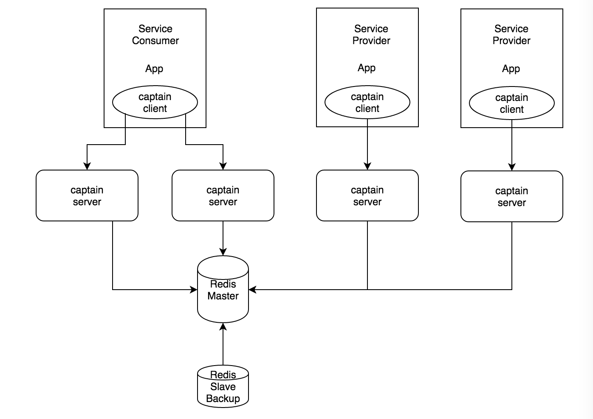
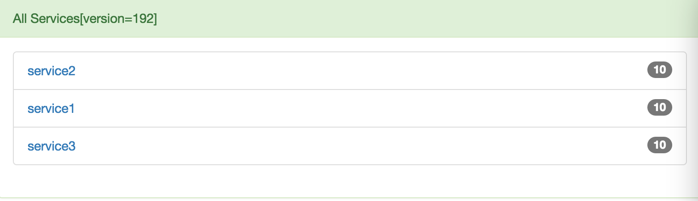
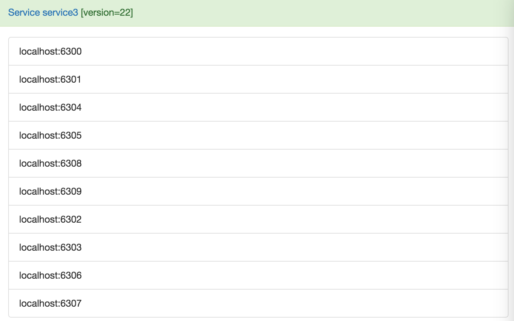
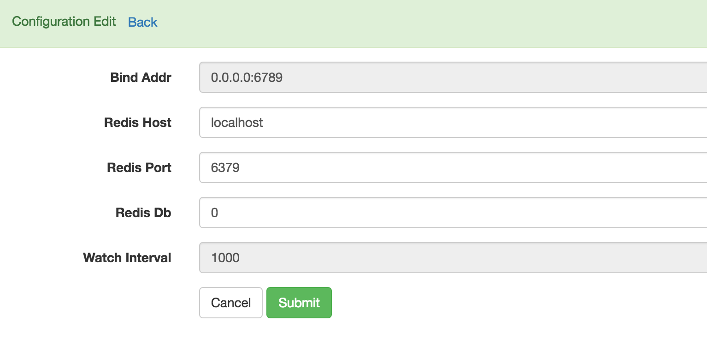
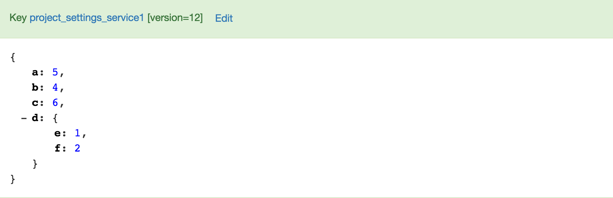

Captain -- Simplest service discovery in the universe
-------------
Captain is yet another service discovery implementation based on redis.
Captain sacrifices a little high availability for simplicity and performance.
In most cases, we don't have tens of thousands of machines, the possibility of machine crashing is very low, high availability is not so abviously important.
But the market only provides zookeeper/etcd/consul, they are complex, at least much complexer compared with captain.

Architecture
-------------



1. Captain server is stateless, Client can connect to multiple captain servers.
2. Captain client can be service provider and service consumer at the same time.
3. If all captain server or redis shutdown, captain client will keep services information in local memory.
4. If just one captain server shutdown, captain client will sync service information from other captain server.
5. If redis master shutdown, you can alway dynamically switch to redis slave using web ui.
6. Carefully monitor captain server and redis, recovery quickly, high availability still can be guaranteed.

Internal
------------
1. Service List is saved into redis as sortedset with key equals host:port and score equals ${now + ttl}
2. Expiring Thread will periodically trim the expired items of this sortedset
3. To track the changes, redis keeps a global version and each sub version for every service list.
4. Client will periodically check the global version, If the global version changed, client will check all version of dependent services, if any dependent service changes, client will reload the changed service list.
5. Less Keys, Large Value. Though captain provided keyvalue api, KeyValue should not be overused.
   Captain server lacks the ability to handle too much keys. Use it only for global configuration and use it less. you can design a large Value instead.
6. Client interact with captain server with http api only

Service Discovery API
------------------------
1. keep service /api/service/keep?name=sample&host=localhost&port=6000&ttl=30 GET
2. cancel service /api/service/cancel?name=sample&host=localhost&port=6000 GET
4. get service version /api/service/version?name=sample1&name=sample2 GET
4. get service list /api/service/set?name=sample GET

KV API
------------------------
1. set /api/kv/set?key=sample&value={"a": "m", "b": "n", "c": {"a": "m", "b": "n"}} POST
2. get /api/kv/get?key=sample GET
3. mget /api/kv/mget?key=sample1&key=sample2 GET
4. get kv version /api/kv/version?key=sample1&key=sample2 GET

Global API
------------------------
1. get global service & kv version in single api /api/version


Install Captain Server
---------------------
```bash
install redis
install java8
install maven

git clone github.com/pyloque/captain.git
cd captain
mvn package
java -jar target/captain.jar
java -jar target/captain.jar ${configfile}  # custom config file

open web ui
http://localhost:6789/ui/
```

Configuration
--------------------
Default Config File is ${user.home}/.captain/captain.ini
```ini
[server]
host = 0.0.0.0
port = 6789
thread = 24 # sparkjava threadpool size

[redis]
host = localhost
port = 6379
db = 0

[watch]
interval = 1000 # service expiring check interval, default 1000ms. server will run in readonly mode if interval=0.

```

Readonly Mode
------------------------
1. service expiring check thread will not be started.
2. service keep and cancel api will not be open

Redis Switch
-----------------------
When redis master oncasionally crashed, you should immediately switch to redis slave.
After switched, server will enter in urgent mode.Expring Watcher Thread is closed
to keep services list always alive.
After all captain servers are switched, click "start watcher" in web ui, to make the server quit urgent mode.

Web UI
------------------------





Client SDK
------------------------
1. Python Client https://github.com/pyloque/pycaptain
2. Java Client https://github.com/pyloque/captain-java
3. Golang Client https://github.com/pyloque/gocaptain
4. Agent Server https://github.com/pyloque/captain-agent
5. PHP Client https://github.com/pyloque/phpcaptain

Reference
-------------------------
1. Wonderful SparkJava https://github.com/perwendel/spark/
2. Simple & Direct ini4j http://ini4j.sourceforge.net/

Notice
-------------------------
Captain is still in development, and it's stability has not been proved yet.
But captain's design is very simple and clear, if you do not want to try captain with bugs,
just make one yourself.


